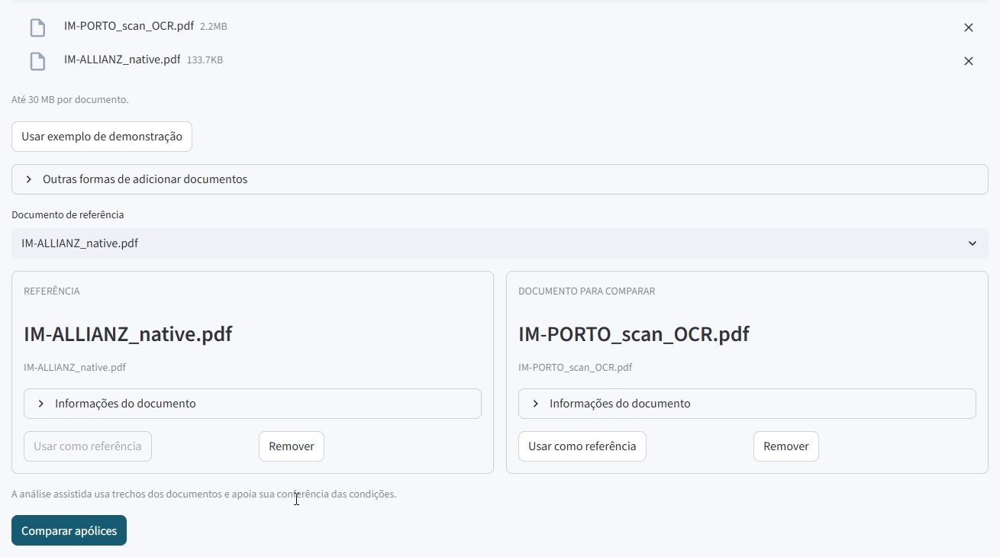
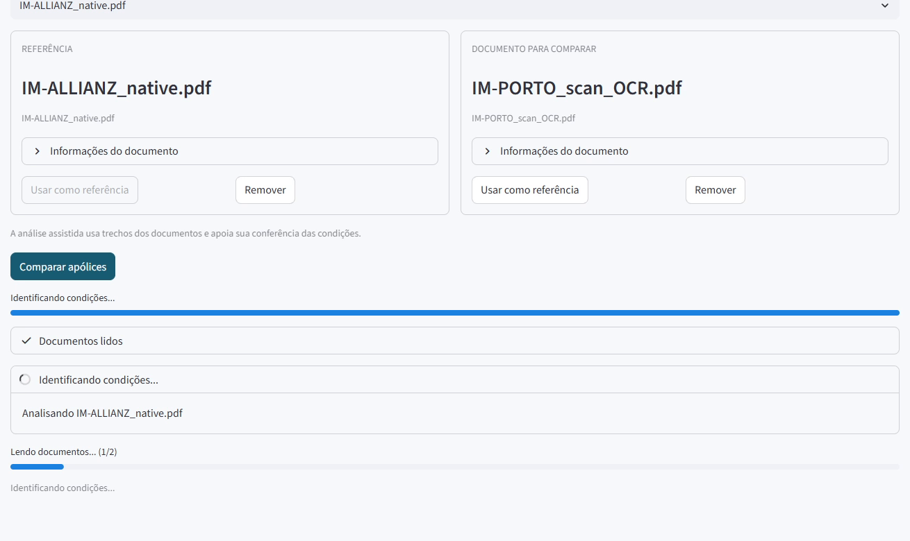
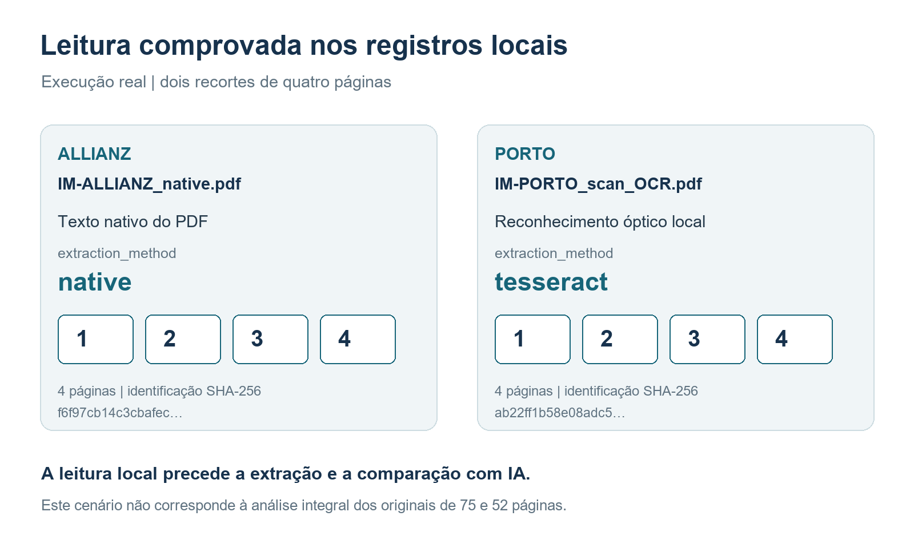
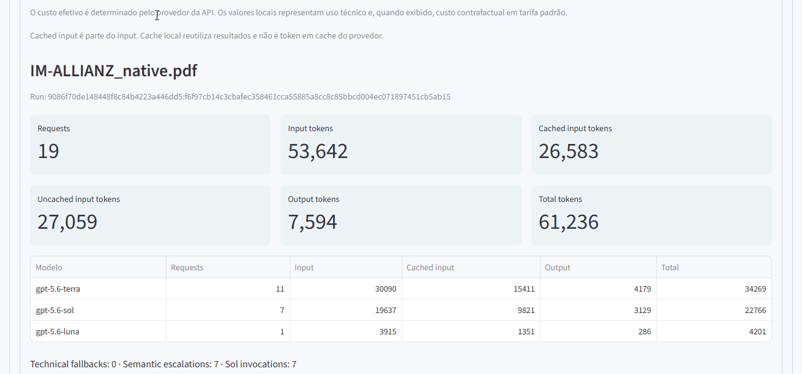
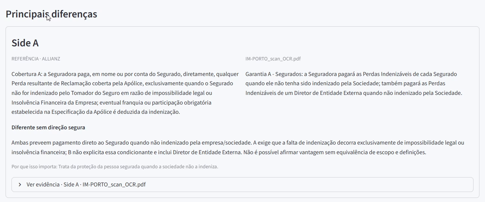
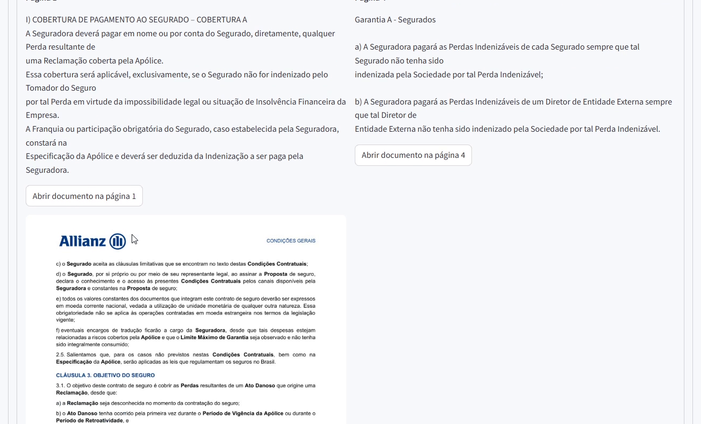

# InsurMinds

## 1. Capa

Plataforma Inteligente para Análise e Comparação de Apólices D&O

Relatório Técnico — Projeto Final I2A2 / InsurMinds

José Leonardo Alves Vilela · Vitor Ferreira · Wagner Assis

Outubro de 2026

Repositório da entrega: https://github.com/malandrindev/Apolices-Projeto-Final

## 2. Resumo executivo

O InsurMinds é um protótipo acadêmico de apoio à análise e comparação de documentos de seguro de responsabilidade civil de diretores e administradores, conhecido como D&O. A solução recebe PDFs ou imagens, extrai o conteúdo, organiza informações relevantes e apresenta diferenças entre um documento de referência e os demais documentos selecionados. O usuário pode conferir a página e o trecho que sustentam cada informação antes de utilizar o resultado.

O trabalho combina extração de texto nativo, OCR local com Tesseract, Inteligência Artificial Generativa, validação de dados e uma interface em Streamlit. A arquitetura prioriza a evidência documental: uma resposta plausível do modelo não é suficiente quando o documento não oferece suporte verificável. Quando a informação é ambígua, não foi recuperada ou está tecnicamente indisponível, essa limitação permanece explícita.

A validação contemplou a interface final, uma demonstração controlada sem chamadas externas e uma execução real de ponta a ponta com dois documentos de quatro páginas: um PDF nativo Allianz e um PDF digitalizado Porto. Nesse cenário, as quatro páginas digitalizadas foram reconhecidas por Tesseract e o processamento com modelos gerou resultados comparativos. Esse resultado demonstra integração operacional; não constitui medição de precisão jurídica nem validação integral dos produtos das seguradoras.

## 3. Contexto e problema

Documentos D&O reúnem definições, coberturas, exclusões, limites de responsabilidade, retenções, prazos e condições de aplicação. Uma cláusula pode depender da contratação de uma extensão, da indicação na especificação da apólice ou de disposições localizadas em outra página. Comparar documentos exige localizar essas informações e preservar suas relações.

O problema não se resume a encontrar palavras iguais. Dois textos podem tratar do mesmo tema com sujeitos, exceções e mecanismos diferentes. Também é comum que condições gerais não contenham informações individuais, como número da apólice, empresa segurada, prêmio, vigência contratada e limite nominal. Preencher essas lacunas com suposições produziria uma comparação enganosa.

A proposta do projeto é reduzir o esforço de localização e organização do conteúdo, oferecendo ao especialista um ponto de partida verificável. O sistema apoia a tomada de decisão e a revisão documental, sem substituir a interpretação de profissionais de seguros, subscrição ou assessoria jurídica.

## 4. Objetivos do projeto

O objetivo geral é desenvolver uma plataforma capaz de extrair, estruturar e comparar informações relevantes de documentos D&O com apoio de IA Generativa. O protótipo deve permitir demonstrar o fluxo completo, da recepção dos arquivos à apresentação das diferenças e suas evidências.

Os objetivos específicos são aceitar documentos em PDF ou imagem; recuperar conteúdo de documentos digitais e digitalizados; organizar campos de interesse em uma estrutura comum; comparar pelo menos dois documentos; mostrar os principais pontos de atenção; e permitir conferência da fonte e exportação dos resultados. A separação de responsabilidades, o tratamento de erros e a documentação das decisões sustentam esses objetivos.

O escopo é um MVP acadêmico. Disponibilidade empresarial, integração com sistemas internos de seguradoras e cobertura exaustiva de todos os produtos D&O não foram assumidas como metas desta entrega.

## 5. Visão geral da solução

A jornada principal foi organizada em torno de uma tarefa de negócio: adicionar documentos, escolher a referência, comparar, examinar diferenças e conferir evidências. São aceitos de dois a cinco documentos no espaço de trabalho. O primeiro documento é a referência inicial, que pode ser alterada antes da comparação.

A leitura e a preparação acontecem automaticamente ao iniciar a comparação. Os resultados aparecem em seis abas: Resumo, Coberturas, Limites & Franquias, Exclusões, Cláusulas e Evidências. O resumo concentra diferenças importantes e informações sem conclusão segura. A revisão humana e os detalhes técnicos ficam disponíveis de forma opcional, sem interromper a jornada principal.

Existe também um exemplo de demonstração pré-processado, que permite explorar a interface sem consumir modelos externos. Essa opção é identificada como demonstração e utiliza especificações fictícias, sem validade contratual.

## 6. Arquitetura da solução

A arquitetura adota componentes Python especializados, coordenados por um pipeline comum. A interface reúne os documentos e apresenta resultados; os componentes de ingestão, leitura, recuperação, extração, comparação e relatório executam tarefas delimitadas. A integração com provedores de IA é isolada em uma camada própria, permitindo manter os contratos de dados independentemente do serviço utilizado.

O conteúdo original é mantido com identificação do documento e páginas. Os trechos selecionados para a IA são uma projeção desse conteúdo, e não sua substituição. O pipeline verifica a saída estruturada e a correspondência das evidências antes de apresentar uma conclusão. JSON, cache local e SQLite atendem às necessidades de persistência do protótipo.

O fluxo principal está representado na Figura 2. Consulta com recuperação aumentada e índice vetorial permanece uma possibilidade adicional do projeto; ela não é requisito para executar a comparação principal.

## 7. Tecnologias utilizadas

Python concentra a lógica de processamento e integração. PyMuPDF lê PDFs, extrai texto nativo e renderiza páginas para reconhecimento ou conferência visual. Tesseract, acessado por pytesseract, realiza OCR local quando a página não apresenta conteúdo textual suficiente. Essas bibliotecas permitem tratar, no mesmo fluxo, fontes digitais e digitalizadas [R2–R3].

Pydantic define e valida os contratos de informação [R4]. Streamlit fornece upload, seleção de referência, acompanhamento do processamento, resultados, evidências e exportações [R5]. Os SDKs OpenAI e Groq integram modelos de IA Generativa por meio de adaptadores próprios; a aplicação escolhe modelos conforme o perfil configurado e a tarefa.

SQLite e arquivos JSON conservam informações estruturadas, resultados e cache. O projeto também contém componentes de recuperação vetorial com Chroma e SentenceTransformers, preservados como recursos opcionais. A escolha foi manter o caminho principal simples, com dependências adicionais carregadas quando necessárias.

## 8. Componentes e agentes especializados

Os agentes são componentes de software com responsabilidades definidas, e não personagens que tomam decisões comerciais autonomamente. A especialização facilita a compreensão do fluxo e a verificação de cada etapa.

| Componente | Responsabilidade principal |
|---|---|
| IngestionAgent | Validar formato, integridade, tamanho e identidade do documento. |
| OcrAgent | Extrair texto nativo ou reconhecer páginas por Tesseract, preservando a origem. |
| SegmentationAgent e recuperação local | Dividir o conteúdo e localizar candidatos relevantes por campo. |
| ExtractionAgent e GroupedExtractionAgent | Extrair e interpretar informações com evidências e validação. |
| ComparisonAgent | Combinar regras objetivas e comparação semântica dos trechos. |
| ComparisonReportAgent | Produzir os arquivos comparativos com diferenças, justificativas e fontes. |
| RagAgent, opcional | Apoiar consultas com recuperação de trechos e citações. |

A coordenação dessas responsabilidades ocorre no pipeline. Cada componente recebe dados tipados e devolve uma estrutura definida, reduzindo o acoplamento entre a apresentação e as operações de domínio.

## 9. Fluxo completo de processamento

O usuário fornece os documentos e escolhe qual deles servirá como referência. O pipeline valida os arquivos, identifica suas páginas e lê o conteúdo. Em PDFs nativos, o texto é recuperado diretamente; páginas sem camada textual suficiente seguem para OCR. O conteúdo resultante é organizado em segmentos associados à fonte.

A recuperação local seleciona candidatos para os campos de interesse. A IA interpreta esses candidatos e devolve informações estruturadas com valor, página, trecho e confiança operacional. O sistema verifica a estrutura da resposta, a existência da citação e a consistência de valores objetivos. Quando necessário, uma etapa seletiva verifica ambiguidades ou falhas, dentro dos limites configurados.

As informações são persistidas e comparadas por pares: referência versus cada candidato. O resultado reúne diferenças, justificativas e evidências dos dois documentos. Ao final, o usuário pode conferir a fonte, registrar uma revisão e exportar o relatório. A Figura 3 mostra o acompanhamento do processamento na interface final.

## 10. Recepção e validação dos documentos

A recepção verifica o tipo real do arquivo, sua assinatura, o tamanho permitido e a integridade necessária à leitura. PDFs protegidos ou corrompidos recebem uma mensagem de erro apropriada. A identificação por SHA-256 permite distinguir o conteúdo e evita tratar nomes de arquivo como prova de identidade.

Upload é a entrada principal. Catálogo de documentos e URL pública aparecem como opções secundárias. O acesso por URL aplica verificações de endereço, transporte, redirecionamento e tamanho. Dados informados por catálogo são metadados de apoio; eles não substituem o documento nem comprovam que uma cobertura foi contratada.

Na organização do espaço de trabalho, a referência é explícita. Essa escolha define o sentido da apresentação das diferenças, sem alterar as informações extraídas das fontes.

## 11. Extração de PDF nativo e OCR

A leitura nativa é preferida quando o texto já está disponível. Essa decisão conserva melhor a informação digital e evita reconhecimento desnecessário. Quando o conteúdo textual é insuficiente, a página é renderizada e reconhecida localmente por Tesseract. Cada página mantém seu número, método de extração e dados de processamento.

O resultado do OCR pode conter erros de caracteres, números, tabelas e pontuação, sobretudo em imagens de baixa qualidade. Por isso, texto reconhecido não é tratado como conclusão contratual. Ele segue pelas mesmas etapas de evidência e revisão, e a imagem da página pode ser consultada pelo usuário.

No cenário real de ponta a ponta analisado neste relatório, o arquivo IM-PORTO_scan_OCR.pdf contém quatro páginas digitalizadas. O registro persistido apresenta extraction_method igual a tesseract em todas as quatro páginas. O arquivo IM-ALLIANZ_native.pdf, também com quatro páginas, foi lido pelo método native. A Figura 4 resume esses registros, sem reproduzir documentos privados ou credenciais.

## 12. Organização, segmentação e recuperação de conteúdo

O texto paginado é dividido em segmentos para preservar a origem e limitar o tamanho enviado ao modelo. Títulos, proximidade textual e termos próprios do domínio ajudam a selecionar candidatos. A recuperação local combina critérios lexicais e agrupamentos por campo, mantendo o corpus integral disponível.

Campos relacionados podem ser extraídos em conjunto, mas grupos heterogêneos são separados quando isso melhora a interpretação. Limites e sublimites, por exemplo, têm um grupo próprio, enquanto retenções e franquias são tratados separadamente. No perfil de extração com roteamento, os 27 campos são distribuídos em 14 grupos, sem duplicar a responsabilidade de um campo entre grupos.

Selecionar candidatos não garante que a informação procurada foi encontrada. Uma cláusula pode ter sido mencionada parcialmente ou depender de uma continuação. A aplicação preserva essa diferença e evita interpretar recuperação incompleta como inexistência de cobertura.

## 13. Uso de Inteligência Artificial Generativa

A IA Generativa é utilizada para extrair informações e interpretar disposições contratuais que ultrapassam regras simples de palavras-chave. Sua entrada é o conteúdo documental selecionado, acompanhado de campos solicitados e um contrato de resposta. As instruções determinam que o documento seja tratado como fonte de dados, sem seguir comandos eventualmente presentes em seu texto.

O roteamento define modelos conforme a tarefa de extração, interpretação, verificação ou comparação. Alternativas técnicas e verificação semântica são mecanismos distintos: uma indisponibilidade de transporte não equivale a uma interpretação juridicamente incompleta. O sistema limita tentativas e preserva registros para que uma execução interrompida não seja repetida automaticamente sem avaliação.

A interface permite consultar modelos utilizados, chamadas e tokens. Tokens reaproveitados pelo provedor são apresentados separadamente do cache local, que reutiliza resultados sem nova inferência. A Figura 5 apresenta a telemetria do produto. Esses registros mostram uso técnico da IA e não constituem, por si sós, comprovação de cobrança financeira.

## 14. Validação e estruturação dos dados

A estrutura comum contém 27 campos, cobrindo identificação, datas, moeda, limites, retenções, prêmio, Side A/B/C, defesa, extensões, base de cobertura, retroatividade, prazos, exclusões, acordo, rateio, jurisdição, territorialidade, cancelamento, renovação e definições. Cada informação localizada deve estar associada a uma página e a um trecho verificável.

A validação verifica formato, campos esperados, literalidade da citação e consistência de números, moedas e datas. Ela também procura omissões materiais no resumo, como condição de contratação, anuência prévia, sujeitos ou exceções. Uma citação verdadeira não torna automaticamente verdadeiro qualquer resumo feito a partir dela.

| Estado de processamento | Significado na análise |
|---|---|
| FOUND | Evidência localizada e validada segundo as verificações implementadas. |
| AMBIGUOUS | Informação conflitante, condicional ou insuficiente para uma interpretação segura. |
| NOT_RETRIEVED | A recuperação ou os candidatos disponíveis não permitem concluir o campo. |
| NOT_FOUND | Evidência não localizada no contexto pesquisado; não comprova ausência contratual. |
| TECHNICAL_UNAVAILABLE | A etapa não pôde ser concluída tecnicamente; não gera conclusão de cobertura. |

A confiança registrada é um indicador operacional, sem calibração estatística. Os estados e a possibilidade de revisão expressam limites do processamento, em vez de preencher lacunas com valores plausíveis.

## 15. Comparação entre documentos

A comparação toma um documento como referência e confronta cada candidato com ele. Regras locais verificam informações objetivas antes da análise semântica. Comparações de montantes exigem moeda e escopo compatíveis; uma data isolada ou um valor sem contexto não determina vantagem contratual.

As disposições de cobertura, defesa, exclusões e demais cláusulas exigem interpretação dos trechos dos dois lados. O resultado pode indicar equivalência, diferença sem ordenação segura ou vantagem restrita a um item quando há suporte. Nunca transforma uma vantagem pontual em declaração automática de melhor apólice.

No resumo, campos de identificação não inflacionam as contagens de diferenças de negócio. Informações insuficientes são destacadas para conferência. A Figura 6 apresenta um item comparativo da execução real com recortes de quatro páginas. A explicação delimita o alcance do resultado e conserva as condições que exigem revisão.

## 16. Evidências e rastreabilidade por página

A apresentação permite abrir a evidência associada a cada campo e examinar os trechos dos dois documentos. O usuário vê o documento, a página e a transcrição que sustentam a informação. A página original pode ser renderizada para conferir o contexto e o conteúdo visual.

Na demonstração controlada, os mapas relacionam as páginas de cada recorte à fonte original. As páginas de especificação fictícia são identificadas como sintéticas. Esse cuidado permite distinguir um valor criado para demonstrar a interface de uma cláusula extraída de um wording real.

A revisão humana pode confirmar, sinalizar necessidade de análise ou registrar uma correção. Essa manifestação é conservada como revisão, preservando a saída original do processamento. O histórico serve à conferência, sem reescrever silenciosamente a evidência documental.

## 17. Interface e experiência do usuário

A interface privilegia as ações necessárias à comparação. Upload ocupa a entrada principal; a seleção de referência é direta; e uma única ação inicia a preparação e a comparação. Configurações de modelos, limites e outras fontes de documentos ficam em áreas secundárias.

Depois do processamento, o resumo executivo aparece primeiro. As abas temáticas permitem aprofundar a leitura, enquanto evidências, revisão humana e uso da IA ficam acessíveis conforme a necessidade. O relatório comparativo em PDF pode ser exportado diretamente; outros formatos estão agrupados separadamente.

Essa organização reduz a quantidade de decisões técnicas exigidas do usuário. Ao mesmo tempo, conserva as informações necessárias para compreender limites do resultado e conferir a fonte. A solução procura tornar a análise verificável, sem transformar o especialista em operador de detalhes internos do pipeline.

## 18. Demonstração e resultados obtidos

Foram utilizados dois contextos complementares. O primeiro é a demonstração offline Porto × Allianz, destinada à exploração da interface. Ela reúne 30 e 33 páginas, respectivamente: duas páginas de especificação fictícia em cada documento e 59 páginas de wordings reais preservadas no conjunto. Os documentos originais fornecidos ao projeto possuem 52 páginas Porto e 75 páginas Allianz; os recortes não equivalem à integralidade de seus produtos.

As especificações da demonstração referem-se à empresa fictícia ALPHA TECNOLOGIA S.A. e contêm os avisos documento de demonstração, dados fictícios e sem validade contratual. Seus limites, prêmios, retenções e datas permitem mostrar comparações objetivas em condições conhecidas. O resultado pré-processado apresenta 14 diferenças de negócio, 3 equivalências e 4 itens sem conclusão segura. Essa contagem descreve a demonstração, não uma medição de desempenho da IA.

O segundo contexto reúne execuções reais com documentos de wording e validações operacionais. Os registros de Berkley e AXA, cujas condições públicas são citadas nas referências [R6–R7], permitiram avaliar o fluxo em documentos extensos, com interpretação conservadora de cláusulas condicionais. O exemplo final de OCR e IA descrito a seguir utiliza um recorte menor e um registro próprio.

Testes automatizados e validações de navegador verificaram ingestão, contratos, cache, progresso, comparação, evidências, revisão e exportação. Esses procedimentos ajudam a controlar regressões do software, mas não substituem uma avaliação jurídica independente dos resultados.

## 19. Validação E2E real

A execução real final foi registrada na interface com IM-ALLIANZ_native.pdf e IM-PORTO_scan_OCR.pdf, ambos de quatro páginas. Allianz foi a referência. O documento Allianz apresentou quatro páginas com leitura nativa, enquanto o documento Porto apresentou quatro páginas reconhecidas por Tesseract. A execução completou leitura, extração, comparação e geração de resultados.

A telemetria persistida registra 37 tentativas HTTP e 37 identificadores de resposta distintos: 19 chamadas relativas ao documento Allianz, 17 ao documento Porto e 1 à comparação. A distribuição de modelos foi 24 chamadas Terra, 11 Sol e 2 Luna. A execução utilizou interpretação e verificação semântica, sem fallback técnico observado nesse registro. Nenhuma nova chamada foi feita para elaborar este relatório.

Os resultados estruturados mantiveram os limites da evidência. Allianz apresentou 3 campos localizados, 12 ambíguos e 12 não recuperados; Porto apresentou 7 localizados, 9 ambíguos e 11 não recuperados. O resumo da interface apresenta 2 diferenças de negócio, nenhuma equivalência e 19 itens sem conclusão segura, excluindo seis campos de identificação. A comparação estruturada contém 27 itens, dos quais 26 permaneceram sem ordenação segura e um recebeu classificação pontual favorável à referência no campo Side B. Esse último é um resultado do processamento que exige conferência especializada, sem estabelecer superioridade global ou precisão jurídica.

O cenário demonstra execução de ponta a ponta e a coexistência de PDF nativo, OCR e IA. Não demonstra análise integral dos originais de 75 e 52 páginas, acurácia de todos os campos ou generalização para qualquer documento D&O. A gravação da execução e os registros locais foram utilizados como evidência, preservando a distinção entre validação real e demonstração offline.

## 20. Limitações conhecidas

A seleção de candidatos pode não recuperar todas as cláusulas relevantes. Trechos de continuação, definições específicas e condições particulares podem alterar o alcance de uma disposição. Resumos de modelos também podem omitir qualificadores materiais mesmo quando a citação está correta. Essas limitações justificam estados conservadores e conferência humana.

Condições gerais não são apólices individuais emitidas. Quando número, tomador, vigência, prêmio, limite ou retenção contratada não aparecem na fonte, a aplicação não deve inventá-los. A ausência desses campos não é falha a ser preenchida por conhecimento externo.

OCR depende da qualidade da imagem e pode reconhecer incorretamente detalhes críticos. Modelos externos estão sujeitos a disponibilidade, limites e custos. A confiança exibida não representa probabilidade calibrada de correção. O protótipo não foi homologado para decisões jurídicas autônomas, uso comercial em produção ou todos os produtos D&O.

A demonstração possui diferenças de versão entre os wordings Porto de 2022 e Allianz de 2025, além de especificações sintéticas. Ela mostra o funcionamento da aplicação, sem representar cotação real ou comparação comercial homogênea.

## 21. Decisões arquiteturais e justificativas

Optou-se por leitura local antes da IA para evitar reconhecimento desnecessário e preservar a origem de cada página. A recuperação de candidatos limita o contexto enviado ao modelo, enquanto o corpus integral permanece disponível. O schema de campos cria uma base comum de comparação e obriga a associação entre informação e evidência.

A separação de extração, interpretação, verificação e comparação torna as responsabilidades compreensíveis. O roteamento por tarefa mantém modelos configuráveis, e limites de tentativas evitam ciclos indefinidos. Cache e registros persistidos reduzem repetição de trabalho; quando há consumo em execução interrompida, a aplicação impede reenvio automático até que o histórico seja avaliado.

JSON e SQLite foram mantidos por sua simplicidade no ambiente acadêmico. A interface em Streamlit permite demonstrar o fluxo sem construir infraestrutura adicional. Componentes opcionais foram preservados, mas não impostos ao caminho principal. A prioridade foi funcionamento consistente com justificativa técnica, em vez de complexidade por si só.

## 22. Possibilidades de evolução futura

Uma evolução relevante é ampliar a avaliação com especialistas e conjuntos de documentos de escopo e período semelhantes. A anotação de campos, condições e evidências permitiria medir recuperação, preservação de qualificadores e qualidade da comparação de maneira mais sistemática.

Também são possibilidades melhorar a detecção de continuidade de cláusulas e tabelas, acrescentar conferência visual direcionada ao OCR, ampliar o tratamento de endossos e especificações individuais e aprimorar a apresentação de conflitos documentais. A evolução deve conservar a ligação entre resultado e fonte.

Integrações com fontes públicas, como catálogos do Open Insurance, podem apoiar descoberta de produtos. Entretanto, dados de produto não equivalem ao contrato individual do cliente. Qualquer ampliação para dados pessoais ou processos operacionais exigiria um desenho próprio de consentimento, segurança e governança, além do escopo deste MVP [R8–R9].

## 23. Conclusão

O InsurMinds demonstra uma aplicação integrada de OCR, IA Generativa, estruturação de dados e comparação documental no contexto de seguros D&O. A solução transforma documentos em informações consultáveis, mantém evidências por página e apresenta limites quando a fonte não permite uma conclusão segura.

O principal resultado do projeto é uma jornada funcional de apoio à análise: o usuário recebe diferenças organizadas e pode retornar ao documento para conferi-las. A execução real com PDF nativo e digitalizado comprova a integração operacional; a demonstração offline permite explorar o produto com dados controlados e claramente identificados.

O trabalho reforça que automação útil em documentos contratuais depende de rastreabilidade e prudência. A plataforma apoia o especialista, preservando a necessidade de julgamento profissional e revisão jurídica quando aplicáveis.

## 24. Referências

[R1] I2A2. InsurMinds: Desafios 3, 4, 5 e Projeto Final. Documento oficial Desafios1.pdf, 15 jul. 2026. Projeto Final: páginas editoriais 20–25; entrega e avaliação: páginas 4–6. Material fornecido no curso.

[R2] PyMuPDF. Documentação oficial: leitura, extração e renderização de PDFs. https://pymupdf.readthedocs.io/en/latest/. Consulta em 5 out. 2026.

[R3] Tesseract OCR. Documentação oficial do mecanismo e reconhecimento de texto. https://tesseract-ocr.github.io/tessdoc/. Consulta em 5 out. 2026.

[R4] Pydantic. Documentação oficial de validação de dados. https://pydantic.dev/docs/validation/latest/get-started/. Consulta em 5 out. 2026.

[R5] Streamlit. Documentação oficial. https://docs.streamlit.io/. Consulta em 5 out. 2026.

[R6] Berkley Brasil. Seguro de Responsabilidade Civil de Diretores e Administradores — D&O. Condições vigentes a partir de 11 dez. 2025, versão 2; processo SUSEP 15414.901494/2017-11. https://www.berkley.com.br/wp-content/uploads/2022/03/Seguro-DO_Vigencia-a-partir-de-11.12.2025_v2.pdf. Fonte pública registrada pelo projeto em 4 out. 2026.

[R7] AXA Seguros. Condições D&O, 12/2025 V1; processo SUSEP 15414.901016/2017-01. https://axa.com.br/minio/cms/CG_AXA_D_and_O_15414_901016_2017_01_20251230_90a6f5bcbc.pdf. Fonte pública registrada pelo projeto em 4 out. 2026.

[R8] SUSEP. Open Insurance: informações institucionais e documentos de referência. https://www.gov.br/susep/pt-br/assuntos/open-insurance/. Fonte consultada na pesquisa do projeto em 4 out. 2026.

[R9] Open Insurance Brasil. Produtos e Serviços — Responsabilidade de Diretores e Administradores. Especificação oficial D&O, versão 2.0.0. https://raw.githubusercontent.com/br-openinsurance/areadesenvolvedor/main/documentation/source/files/swagger/current/directors-officers-liability.yaml. Fonte consultada na pesquisa do projeto em 4 out. 2026.

[R10] Porto Seguro. Condições de Responsabilidade Civil D&O para Capital Fechado, fev. 2022; processo SUSEP 15414.901349/2019-94. Documento de 52 páginas fornecido localmente pelos participantes. Não foi verificada URL de publicação que comprove a identidade desse arquivo.

[R11] Allianz Seguros. Condições Gerais D&O, dez. 2025; processo SUSEP 15414.901113/2017-96. PDF público oficial: https://www.allianz.com.br/content/dam/onemarketing/iberolatam/allianz-br/doc-para-links/CG_RCDO_1225.pdf. O documento local de 75 páginas foi fornecido pelos participantes; a identidade por hash entre o arquivo local e o download público não foi verificada. Portal do produto: https://www.allianz.com.br/seguros/grandes-riscos/linhas-financeiras/responsabilidade-civil-diretores-e-administradores.html. Consulta em 5 out. 2026.

[R12] InsurMinds. Código-fonte e materiais do Projeto Final. https://github.com/malandrindev/Apolices-Projeto-Final. A identificação da equipe foi obtida do README do repositório público anterior à atualização desta entrega.

[R13] InsurMinds. Registros locais de processamento, comparação e leitura OCR da execução real de 5 out. 2026; manifesto da demonstração demo-do-v1 e mapas de origem. Material técnico do projeto, utilizado para elaborar resultados e figuras sem novas chamadas aos provedores.
