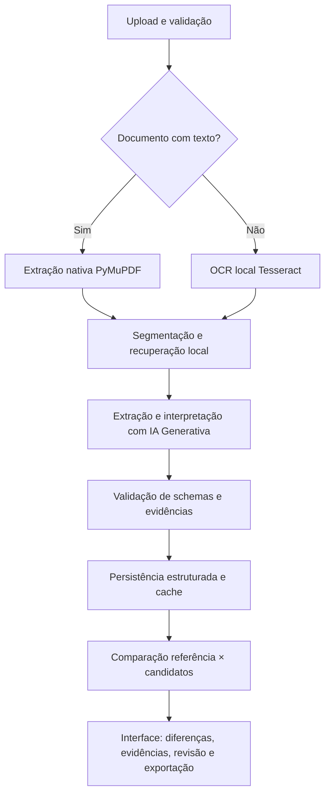
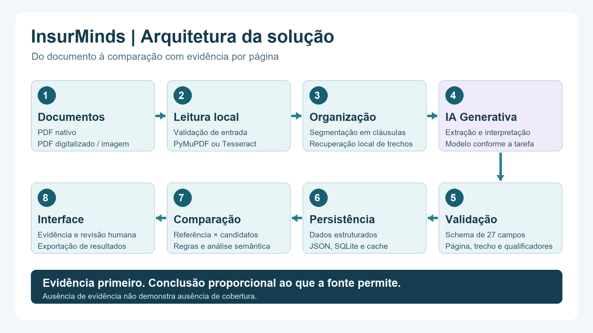
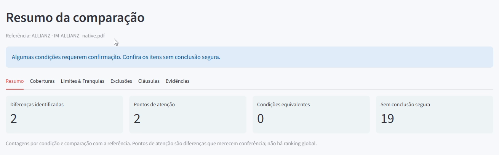

# InsurMinds

## Descrição

InsurMinds é um MVP acadêmico do programa I2A2/InsurMinds para analisar e comparar documentos de seguro de Responsabilidade Civil de Diretores e Administradores (D&O). Recebe de dois a cinco documentos, organiza informações em 27 campos e compara cada candidato com uma referência. As conclusões ficam ligadas a trechos e páginas da fonte para conferência humana.

## Problema

Condições D&O são extensas e usam linguagem contratual. Comparar coberturas, exclusões, defesa, retenções, limites e prazos exige localizar informações distribuídas pelo documento e interpretar suas condições. O projeto busca reduzir esse trabalho de localização e organização, preservando a possibilidade de verificar cada conclusão.

## Objetivo

Integrar leitura de documentos, OCR local, IA Generativa, dados estruturados e interface de consulta em uma solução demonstrável. A aplicação apoia a decisão e a revisão de especialistas; não substitui análise jurídica, subscrição ou aconselhamento profissional.

## Principais funcionalidades

- Upload de PDF ou imagem, incluindo PDF digitalizado sem camada textual.
- Extração nativa com PyMuPDF e OCR local com Tesseract quando necessário.
- Segmentação de cláusulas e recuperação local de conteúdo relevante.
- Extração e interpretação com IA Generativa, roteamento por tarefa e controles de tentativas.
- Comparação de uma referência com até quatro documentos candidatos.
- Resumo de diferenças, evidências por página e estados conservadores para informação insuficiente.
- Revisão humana opcional e exportação PDF, Markdown, JSON e formatos complementares da interface.
- Telemetria de modelos, requests e tokens, distinguindo cache local de tokens em cache no provedor.
- Demonstração offline pré-processada, sem chave de API ou inferência.

## Arquitetura





## Componentes / agentes

| Componente | Responsabilidade |
|---|---|
| Ingestão e fontes | Validar arquivos, tamanho, identidade e origem documental. |
| OCR | Ler o texto nativo ou reconhecer páginas/imagens com Tesseract. |
| Segmentação e retrieval | Organizar cláusulas e selecionar contextos locais sem perder a referência à página. |
| Extração e interpretação | Preencher campos D&O com GenAI, validando estados e suporte textual. |
| Comparação | Confrontar os dados da referência e de cada candidato, respeitando limitações de escopo. |
| Relatórios | Produzir saídas comparativas com evidências. |
| Workspace Streamlit | Apresentar resultados, revisão, exportação e uso da IA. |

## Tecnologias utilizadas

Python 3.11+, Streamlit, PyMuPDF, Tesseract/pytesseract, Pillow, Pydantic, SQLite e integrações OpenAI/Groq. ChromaDB, sentence-transformers e PyTorch apoiam o módulo opcional de consulta semântica. Pytest e AppTest dão suporte aos testes offline. Ferramentas de geração dos artefatos usam python-pptx, PyMuPDF e FFmpeg.

## Estrutura do projeto

```text
src/                       Agentes, schemas, retrieval, persistência e controles
interface/app.py           Interface Streamlit
main.py                    Entrada CLI compatível com o projeto original
scripts/                   Instalação, validação e produção de artefatos
tests/                     Regressões e integrações offline
data/demo/                 Demonstração fictícia e mapas de evidência
data/demo_sources/         Documentos-base da demonstração, preservados por hash
data/processed/            Resultados e caches locais, ignorados no Git
docs/                      Arquitetura, referências e validação da entrega
Projeto_Final_Artefatos/    Relatório PDF, apresentação e vídeo oficial
```

## Pré-requisitos

Python 3.11 ou superior. Tesseract com os idiomas português e inglês para documentos digitalizados. A demo com texto nativo não requer OCR nem chave de API. Processamento novo com GenAI exige credencial do provedor escolhido e pode ter custo. O ambiente original inclui dependências de embeddings; a instalação pode demandar espaço e tempo.

## Instalação

No PowerShell, a partir da raiz do projeto:

```powershell
py -3.11 -m venv .venv
.\.venv\Scripts\python.exe -m pip install -r requirements-dev.txt
.\.venv\Scripts\python.exe -m pip check
if (-not (Test-Path -LiteralPath .env)) {
    Copy-Item -LiteralPath .env.example -Destination .env
}
```

No Linux/WSL, crie um ambiente com `python3 -m venv .venv`, ative-o e instale `requirements-dev.txt`. Instale Tesseract e os pacotes de idiomas português/inglês pelo gerenciador do sistema. O arquivo `requirements-artifacts.txt` contém ferramentas opcionais para QA de navegador e produção dos entregáveis; elas não são necessárias para usar a demo.

## Configuração

Use [.env.example](.env.example) como base e edite apenas o `.env` local. A demo funciona sem credenciais. Para processamento novo autorizado, configure o provedor e sua chave; por exemplo, os nomes das opções OpenAI são `LLM_PROVIDER`, `OPENAI_API_KEY` e `MODEL_ROUTING_ENABLED`. Groq continua disponível pelas opções correspondentes do exemplo.

O limite de operações reduz tentativas; não é um teto monetário. O perfil OpenAI com routing registra reservas antes de enviar e não repete automaticamente o mesmo modelo para a mesma etapa. Histórico incompleto é protegido contra reenvio. Não apague esse histórico para contornar o controle.

## Tesseract / OCR

PDFs com texto selecionável usam extração nativa. Páginas sem texto suficiente e imagens são reconhecidas com Tesseract. No Windows, o instalador portátil do projeto verifica os downloads:

```powershell
powershell -NoProfile -ExecutionPolicy Bypass -File .\scripts\setup_tesseract.ps1
```

Os binários ficam em `data/processed/tooling/tesseract/`, fora do Git. Configure `TESSERACT_CMD` no `.env` para o executável da sua instalação e `OCR_LANGUAGES=por+eng`. Também é possível usar uma instalação no PATH. No Linux/WSL, os pacotes usuais são `tesseract-ocr`, `tesseract-ocr-por` e `tesseract-ocr-eng`.

## Execução

```powershell
.\.venv\Scripts\python.exe -m streamlit run interface/app.py --server.address 127.0.0.1 --server.port 8503 --server.fileWatcherType none --browser.gatherUsageStats false
```

Abra **http://127.0.0.1:8503**. No Linux/WSL, use `python` do ambiente virtual no mesmo comando.

## Como utilizar

1. Envie de dois a cinco documentos em **Upload**.
2. Escolha o documento de referência; o primeiro é selecionado inicialmente.
3. Clique **Comparar apólices**. A preparação local ocorre automaticamente.
4. Confira o resumo e as abas; abra uma evidência para verificar documento, página e trecho.
5. Revise itens quando necessário e use **Exportar relatório**.

Fontes por URL e catálogo ficam em uma área secundária. Modelos, orçamento de operações e detalhes de uso ficam em **Configuração avançada** e **Detalhes técnicos**.

## Demonstração

Clique **Usar exemplo de demonstração → Comparar apólices**. O exemplo Porto/Allianz usa especificações fictícias, excertos de condições gerais reais e comparação pré-processada. Os avisos **dados fictícios / sem validade contratual** permanecem visíveis. Essa jornada não constrói um cliente de IA nem faz requests ao provedor.

A validação E2E real registrada utilizou dois recortes de **quatro páginas cada**: Allianz com texto nativo e Porto convertido em PDF de imagens. As quatro páginas Porto registraram `extraction_method=tesseract`; a execução GenAI e a comparação foram concluídas. Esse cenário demonstra integração e funcionamento, não precisão integral dos documentos-base de 75/52 páginas. Os resultados conservam campos ambíguos ou não recuperados. Veja o relatório e a [validação final](docs/FINAL_DELIVERY_VALIDATION.md).



## Testes

```powershell
.\.venv\Scripts\python.exe -m pytest -q
.\.venv\Scripts\python.exe -m compileall -q src interface scripts tests
.\.venv\Scripts\python.exe scripts/check_secrets.py
```

A suíte usa mocks e dados locais. Fixtures públicas opcionais não incluídas na entrega podem ser puladas quando ausentes. Os runners de pilotos reais presentes em `scripts/` são registros de reprodução controlada; não são necessários para iniciar, testar ou demonstrar o produto. Não execute providers para reconfirmar evidências da entrega.

## Limitações conhecidas

Condições gerais não equivalem a uma apólice emitida e podem não conter número, tomador, prêmio, vigência ou limites individuais. O sistema não inventa esses dados. `NOT_RETRIEVED` significa que o campo não foi recuperado com segurança, não ausência contratual. `AMBIGUOUS` exige conferência; `TECHNICAL_UNAVAILABLE` indica uma limitação técnica do processamento. `NOT_FOUND` requer suporte ao escopo analisado.

Não há declaração global de “melhor apólice”. OCR depende da qualidade da imagem; trechos isolados podem ser insuficientes para interpretar condições e exceções. A confiança operacional não é uma probabilidade calibrada de acerto. O projeto é um MVP acadêmico, sem alegação de prontidão comercial ou cobertura de todos os produtos D&O.

## Segurança / credenciais

`.env`, caches, dados processados e gravações brutas ficam locais. Não coloque chaves em código, prints, relatórios ou commits. `.env.example` contém apenas campos vazios e parâmetros de configuração. Cached tokens retornados pelo provider e reutilização de cache local são medidas distintas; a telemetria não comprova gratuidade.

## Integrantes

- **Vitor Ferreira** — [malandrindev](https://github.com/malandrindev)
- **José Leonardo Alves Vilela** — [leo-vilelela](https://github.com/leo-vilelela)
- **Wagner Assis** — [wabassis](https://github.com/wabassis)

Identificação preservada do README do repositório oficial anterior à release (commit `082da47d8f034ed266603d8ec8b317113130d647`). O MVP original de Leo tem origem em [desafio_final_insurminds_comparacao_entre_apolices](https://github.com/leo-vilelela/desafio_final_insurminds_comparacao_entre_apolices), commit `02802f6cca9a54064c0425a4882301595e6d18ff`.

## Entregáveis

[Projeto_Final_Artefatos/](Projeto_Final_Artefatos/) reúne:

- [Relatório técnico PDF](Projeto_Final_Artefatos/InsurMinds_Relatorio_Tecnico.pdf)
- [Pitch Deck](Projeto_Final_Artefatos/InsurMinds_Projeto_Final.pptx)
- [Vídeo oficial](Projeto_Final_Artefatos/InsurMinds_Projeto_Final.mp4), com até cinco minutos

O ZIP de entrega é `InsurMinds_Projeto_Final.zip`, gerado localmente com código e artefatos. A [matriz final](docs/FINAL_DELIVERY_VALIDATION.md) registra verificações e o [checklist de envio](docs/DELIVERY_CHECKLIST.md) orienta a entrega pelo representante. Nenhum e-mail é enviado pela aplicação.

## Licença

Código distribuído sob a licença [MIT](LICENSE). Documentos e marcas de terceiros conservam sua titularidade; o uso documental da demo é identificado e não representa contratação ou endosso das seguradoras.
