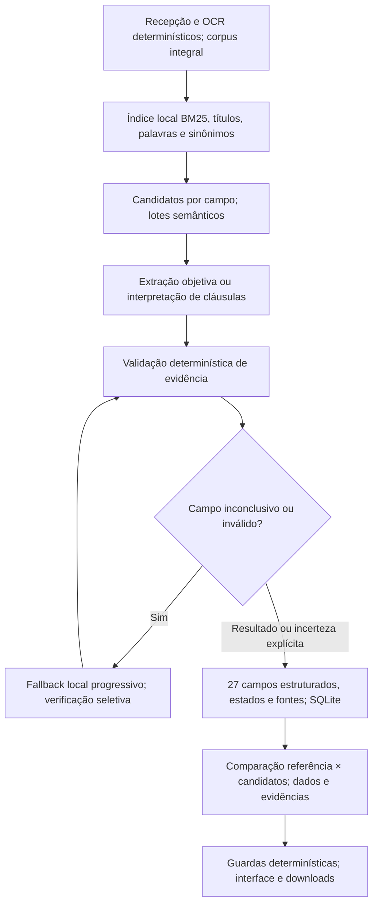

# PUBLIC_EXTRACTION_OPTIMIZATION — PHASE E1

Estado histórico na conclusão E1, em 04/10/2026: **E1 implementada e validada offline**. O apêndice FAST-TRACK registra as medições reais posteriores. GenAI em documentos públicos, precisão semântica, latência real e faturamento público continuam sem medição. E0 permanece no checkpoint 054e4ac; a E0.1 posterior executou somente duas requests neutras autorizadas, registradas em [COMPLIMENTARY_MODEL_VALIDATION.md](COMPLIMENTARY_MODEL_VALIDATION.md). Não houve processamento público real.

## Arquitetura e decisões

O texto de todas as páginas permanece local. A otimização seleciona evidências a enviar à LLM; nenhuma página/chunk é apagada do corpus. O fluxo usa componentes Python e a abstração existente OpenAI/Groq, sem hosted tools, embeddings pagos ou Agents SDK.



A validação precede a comparação para impedir que evidência rejeitada gere vantagem contratual. O ComparisonAgent mantém sua avaliação/reparo existente de diferenças semânticas. O verifier da extração opera apenas nos campos sinalizados; não relê tudo após cada comparação.

| Responsabilidade | Implementação | Evidência offline |
|---|---|---|
| Índice e corpus integral | src/retrieval/local.py: LocalRetrievalIndex.build, plan, expand; tuples de páginas/chunks originais | tests/test_local_retrieval.py; hashes e 1100 chunks conferidos |
| Grupos/lotes | src/agents/grouped_extraction.py: build_semantic_batches, GroupedExtractionAgent | tests/test_grouped_extraction.py; múltiplos campos/lote, deduplicação |
| Schema e estados | src/schemas/retrieval.py; sidecars ExtractionResult/Phase2Report em src/agents/extraction.py | schema legado de 27 campos preservado; roundtrip SQLite |
| Rota, settings e modelos | src/config.py; src/pipeline.py; src/llm/openai_client.py | tests/test_extraction_configuration.py; fake OpenAI/Groq |
| Comparação conservadora | src/agents/comparison.py; src/workspace.py | tests/test_retrieval_workspace.py e testes legados; inconclusivo sem ranking |
| UI e relatórios | interface/app.py; src/comparison_cli.py; scripts/check_workspace_browser.py | Edge real com gateway fake/cache e SDKs bloqueados |
| Planejamento sem cliente/API | scripts/plan_public_extraction.py | tests/test_public_extraction_planner.py; serialização real de mensagens/schema |

Sete grupos cobrem exatamente os 27 campos existentes: IDENTIFICATION (7), LIMITS (3), CORE_COVERAGES (7), TEMPORAL (4), SCOPE (2), EXCLUSIONS (1), EXTENSIONS_DEFINITIONS (3). Extração simples atende identification/limits; grupos que exigem leitura semântica usam interpretação. Um lote retorna diversos campos e não passa automaticamente pelos dois papéis.

BM25, headings, aliases, proximidade e inclusão genérica de capa reduzem custo sem usar LLM para roteamento/títulos. Campos críticos têm quota inicial conservadora de pelo menos quatro candidatos. Não há página ou marca de seguradora hard-coded na lógica. Diagnósticos registram páginas/chunks pesquisados, candidatos selecionados, stage, overflow e limitação da busca.

Fallback por campo: top-N inicial → ampliar N → páginas vizinhas → seção completa → busca lexical específica no corpus integral. A expansão só solicita inferência se houver novas associações campo × chunk. O guard de seção tem oito páginas; overflow é explícito. Nenhuma etapa monta uma request com o PDF inteiro. No cenário em que todos os campos continuam inconclusivos, o conjunto agregado de fragmentos pode se aproximar do corpus inteiro; o budget deve encerrar a execução antes de crescimento não autorizado.

O verifier atende evidência inválida, conflito, AMBIGUOUS, baixa confiança operacional, fallback relevante ou NOT_RETRIEVED persistente com candidatos. Há no máximo quatro etapas de expansão e uma passagem de verificação seletiva. Campo sem candidato não recebe verifier vazio. Trecho precisa existir no fragmento enviado e na página original; números/datas/moeda/Side A/B/C também passam por regras determinísticas. Confiança abaixo de 0,75 sinaliza revisão; não representa probabilidade calibrada.

| Estado | Significado e tratamento |
|---|---|
| FOUND | Valor localizado com evidência validada |
| NOT_FOUND | Não localizado após a busca local do campo sem limitação registrada; não demonstra ausência contratual |
| NOT_RETRIEVED | Busca/modelo não recuperou evidência suficiente ou permaneceu limitado; UI “Busca inconclusiva” |
| AMBIGUOUS | Evidência conflitante, inválida ou verificação não confirmou conclusão; UI “Evidência ambígua” |

NOT_RETRIEVED nunca vira NOT_FOUND somente para preencher saída. Se o verifier não confirmar um valor antes localizado, o sistema preserva evidência para revisão e marca AMBIGUOUS. A comparação desses estados permanece NOT_COMPARABLE. valor/pagina/trecho_origem/confianca originais ficam no FieldEvidence; status/proveniência/diagnósticos ficam nos sidecars, com defaults compatíveis com JSON/SQLite anteriores.

Cache por lote e resultado agregado usam SHA, corpus/chunks, papéis/modelos, prompts, schema, retrieval e settings. Cache final exige 27 estados consistentes e evidência original validada; auth/quota/timeouts/incomplete não viram resultado final reutilizável. Cache local e cached tokens do provedor são medidas distintas. Diagnósticos voláteis não invalidam o cache da comparação. Expansões podem reenviar contexto previamente selecionado para preservar relações semânticas; isso está contado nas estimativas, sem alegar eliminação de toda duplicação.

## Corpus e fontes oficiais

| Documento | Versão/escopo | Páginas | Chunks locais | Caracteres nativos | Corpus integral |
|---|---|---:|---:|---:|---|
| Berkley D&O | Condições públicas, vigência a partir de 11/12/2025, v2; capital não confirmado | 83 | 480 | 242537 | YES |
| AXA D&O | Condições públicas 30/12/2025, v1; particulares condicionais | 104 | 620 | 236524 | YES |
| Total | Documentos gerais do mesmo ramo, sem comprovação de contratação | 187 | 1100 | 479061 | YES |

Fontes: [Berkley — condições oficiais](https://www.berkley.com.br/wp-content/uploads/2022/03/Seguro-DO_Vigencia-a-partir-de-11.12.2025_v2.pdf), [AXA — condições oficiais](https://axa.com.br/minio/cms/CG_AXA_D_and_O_15414_901016_2017_01_20251230_90a6f5bcbc.pdf). Processo SUSEP Berkley 15414.901494/2017-11, localizado na p.1; AXA 15414.901016/2017-01 identificado no arquivo oficial. Escopo e comparabilidade têm limites registrados no [preflight D](PUBLIC_VALIDATION_PREFLIGHT.md).

SHA-256 Berkley: 038683e096c2ae0378df25ef18d147493f72627399d1530310af14023df8fea8.
SHA-256 AXA: 1798723c7a3078496bfc9dcedcc5a02ac5e1a5466784264d517f3ad9f8bc5f19.

PDFs e manifestos ficam ignorados em data/processed/public_validation_preflight/. O planner confere caminho/hash/páginas/chunks e usa OCR nativo/cache local, sem baixar novamente nem construir cliente GenAI.

## Baseline versus optimized — contagens locais

Uma operação lógica é um despacho ao gateway. Uma operação pode produzir até três tentativas HTTP na configuração existente. As contagens abaixo são **potenciais/planejadas**, não inferências públicas realizadas.

EXPECTED é um cenário diagnóstico: todos os grupos iniciais, expansão somente dos campos com âncoras fixas ainda ausentes e uma verificação dos campos expandidos. O oracle da golden set é usado apenas pelo planejador; a produção usa estados/evidências retornados. Esse cenário não prediz sucesso da IA, confiança ou conclusão dos 27 campos.

CONSERVATIVE mantém todos os campos inconclusivos nas quatro expansões e sinaliza todos para uma verificação, sem retry HTTP. WORST_REASONABLE usa essa mesma carga lógica com três tentativas HTTP por operação. Estes cenários não são um limite matemático para todo caminho adaptativo; o planner também registra bound estrutural separado, deliberadamente amplo e impraticável para piloto.

| Métrica | Berkley | AXA |
|---|---:|---:|
| PAGES / FULL LOCAL CHUNKS | 83 / 480 | 104 / 620 |
| Baseline chunk calls + títulos | 480 + 16 = 496 | 620 + 24 = 644 |
| Baseline com um reparo por chunk | 976 lógicas | 1264 lógicas |
| INITIAL UNIQUE CANDIDATES | 80 | 72 |
| INITIAL SEMANTIC BATCHES | 7 | 7 |
| Candidatos únicos após fallback guiado (união cumulativa) | 304; +224 sobre inicial | 186; +114 sobre inicial |
| FALLBACK BATCHES — EXPECTED | 20 | 3 |
| VERIFIER BATCHES — EXPECTED | 15 | 2 |
| COMPARISON BATCHES por documento isolado | 0 | 0 |
| Reparo JSON extra — rota agrupada | 0 | 0 |
| EXPECTED TOTAL | 42 lógicas / 42 HTTP | 12 lógicas / 12 HTTP |
| FALLBACK / VERIFIER — CONSERVATIVE | 122 / 78 | 136 / 73 |
| CONSERVATIVE TOTAL | 207 lógicas / 207 HTTP | 216 lógicas / 216 HTTP |
| WORST_REASONABLE TOTAL | 207 lógicas / 621 HTTP | 216 lógicas / 648 HTTP |
| Retry budget extra — WORST | 414 tentativas | 432 tentativas |
| Candidatos finais — todos inconclusivos | 478 de 480 | 590 de 620 |
| Redução EXPECTED versus baseline sem reparos | 454 / 91,53% | 632 / 98,14% |
| Âncoras golden inicial → final | 13/17 → 17/17 | 2/3 → 3/3 |
| Âncoras críticas inicial → final | 11/11 → 11/11 | 2/2 → 2/2 |

Para o par, ComparisonAgent acrescenta até 2 lotes semânticos, até 4 operações com um reparo por lote ou até 12 tentativas HTTP no stress. Usa dados estruturados/evidências e regras objetivas Python; nenhum PDF é relido. Comparação não foi executada neste preflight.

- Par EXPECTED: baseline 1142 = 496 + 644 + 2; optimized 56 = 42 + 12 + 2; redução potencial 1086 / **95,10%**.
- Par CONSERVATIVE: 427 = 207 + 216 + 4 versus baseline com todos os reparos 2244; redução 1817 / **80,97%**.
- Par WORST HTTP: 1281 = 621 + 648 + 12 versus baseline stress HTTP 6732; redução 5451 / **80,97%**.

As bases de comparação são explicitadas para não misturar operações lógicas, retries e reparos. Sete lotes são somente a carga inicial por documento. A meta de concluir entre 10 e 30 chamadas ainda não está provada: o diagnóstico Berkley exige 42. Aumentar artificialmente a certeza para caber nesse número seria incorreto.

## Golden set e recall

[public_retrieval_golden.json](../tests/fixtures/public_retrieval_golden.json) contém **20 âncoras curtas selecionadas manualmente e verificadas diretamente nos PDFs**: 17 Berkley e 3 AXA. Cada item tem documento/SHA, campo, tema, página e trecho literal. O teste exige campo correto, página correta e trecho presente no fragmento selecionado; normaliza whitespace, preserva caixa/pontuação. Nenhuma LLM produziu a referência.

| Etapa local | Berkley | AXA | Total |
|---|---:|---:|---:|
| Inicial | 13/17 | 2/3 | 15/20 — 75% |
| Ampliar N | 15/17 | 2/3 | 17/20 — 85% |
| Vizinhas | 16/17 | 3/3 | 19/20 — 95% |
| Seção | 16/17 | 3/3 | 19/20 — 95% |
| Busca específica por campo | 17/17 | 3/3 | 20/20 — 100% |

KNOWN FACTS/âncoras = 20; FOUND IN INITIAL CANDIDATES = 15; novos FALLBACK HITS = 5; FOUND AFTER FALLBACK = 20; MISSED finais = 0. “Fact” aqui significa presença do tema/trecho, sem inferir valor ou cobertura contratada.

**CRITICAL FIELD RECALL: 13/13 = 100% desde o início e após fallback.** A golden inclui LMG, sublimites, franquia/retenção no mesmo campo, Side A/B/C, custos de defesa, retroatividade, territorialidade, jurisdição e exclusões; repetição de Side C/defesa na AXA soma duas âncoras. Não se alegam 13 campos distintos, recall de cláusulas desconhecidas ou cobertura integral de todos os temas AXA.

| Miss inicial | Campo / página correta | Trecho esperado | Por que não recuperou inicialmente | Primeiro fallback que recupera |
|---|---|---|---|---|
| G02 Berkley | seguradora / 6 | Berkley. | Página não selecionada para esse campo; referências genéricas/capa tiveram score maior | Stage 4: busca lexical específica do campo, sem hard-code da marca |
| G15 Berkley | cancelamento_renovacao / 33 | RENOVAÇÃO | Página fora da quota top-N | Stage 1: ampliar N |
| G16 Berkley | premio / 36 | PRÊMIO | Página presente, porém trecho literal fora do fragmento selecionado para o campo | Stage 1: ampliar N |
| G17 Berkley | periodo_estendido_notificacao / 7 | Prazo Adicional | Página/definição fora da seleção inicial | Stage 2: páginas vizinhas |
| G19 AXA | periodo_estendido_notificacao / 57 | PRAZO COMPLEMENTAR PARA APRESENTAÇÃO DE RECLAMAÇÕES | Página fora da seleção inicial | Stage 2: páginas vizinhas |

Essas expansões genéricas afetam também outros campos: ampliar N cresce a quota, vizinhas preservam relações entre cláusulas, busca específica recupera metadados/aliases no corpus. Deduplicação reduz repetição dentro do lote; scores/quotas não descartam o texto local. As âncoras não são passadas à lógica de produção para forçar resultado.

Os 27 campos têm candidatos em ambos os documentos, mas **27/27 candidatos não equivale a 27 valores extraídos**. CGs podem definir LMG/prêmio/retroatividade sem informar valor contratado; Side C pode estar condicionado à contratação. Precisão da extração, evidência e página retornadas por modelo continuam PENDING_REAL_PILOT.

## Tokens, custos e limites

O planner serializa mensagens reais, modelos, max_output_tokens, reasoning e schema strict. Sem tokenizer, entrada aproximada = caracteres/3,5 + 1000 por request; reserva = bytes UTF-8 + 1000 por request. Saída EXPECTED assume 1500 tokens/operação; saída conservadora usa o cap 4500 por operação, incluindo reasoning. Esses números não são medições de usage nem tetos de cobrança.

Tabela abaixo usa os papéis existentes Luna (simples), Sol (semântica), Terra (verificação), sem alterar .env. O multiplicador global 1,25 na entrada é uma reserva de cenário do preflight, sem afirmar que todos os modelos cobram esse adicional. Não foram assumidos descontos de cached tokens nem incentivo.

| Cenário | Entrada Berkley / AXA | Saída Berkley / AXA | US$ Berkley / AXA, com reserva descrita |
|---|---:|---:|---:|
| EXPECTED, aproximação | 299941 / 65937 | 63000 / 18000 | 1,131294 / 0,522438 |
| CONSERVATIVE, reserva | 5199910 / 5458143 | 931500 / 972000 | 28,037527 / 30,450989 |
| WORST_REASONABLE, 3 HTTP | 15599730 / 16374429 | 2794500 / 2916000 | 84,112581 / 91,352967 |

Tarifas datadas e fontes estão em [OPENAI_PRICES_2026-10-04.json](OPENAI_PRICES_2026-10-04.json); o [billing audit](OPENAI_BILLING_AUDIT.md) separa consumo técnico, incentivo confirmado e custo desconhecido. Quota complimentary restante não foi consultada.

Budget UI existente: 30 operações lógicas por padrão, até 100 configuráveis; até três tentativas HTTP por operação. A CLI atual não compartilha esse wrapper. **Não contornar o budget pela CLI.** Sob o limite 30, um caminho mais longo deve interromper e preservar caches/estado inconclusivo. Na autorização futura do piloto, um wrapper explícito de limite lógico e config de uma tentativa HTTP precisam governar o gateway. Nenhuma execução/budget pago foi ativado nesta E1.

## Routing flexível, sem escolha definitiva

.env permaneceu intacto. PUBLIC_EXTRACTION_STRATEGY=auto ativa a rota com pelo menos 8 páginas OU 20 chunks; documentos menores usam a rota legada. optimized/legacy são escolhas explícitas. Limites e quatro papéis estão em [.env.example](../.env.example).

| Papel | Environment/settings | Proposta de piloto já conciliada na E0 |
|---|---|---|
| Extraction objetiva | EXTRACTION_MODEL_SIMPLE | gpt-5.4-mini-2026-03-17 |
| Clause Interpretation | EXTRACTION_MODEL_INTERPRETATION | gpt-5.4-2026-03-05 |
| Comparison | EXTRACTION_MODEL_COMPARISON | gpt-5.4-2026-03-05 |
| Verifier | EXTRACTION_MODEL_VERIFICATION | gpt-5.2-2025-12-11 |
| Alternativas compatíveis, escolha manual | mesmos settings | gpt-4.1-mini-2025-04-14; gpt-5.6-luna |

Papéis vazios herdam fast/strong/intermediate ou strong/strong atuais. Não há fallback automático de provedor/modelo para erros financeiros. Terra e Sol continuam compatíveis, com duas requests neutras concluídas na E0.1 e **Dashboard PENDING_DASHBOARD_RECONCILIATION**; não foram promovidos a routing definitivo. Nenhum agente hard-code modelos comerciais na lógica.

## Piloto real — somente proposta

**Documento: Berkley D&O, v2 11/12/2025**, pois possui 17 âncoras de referência, incluindo 11 críticas, versus apenas 3 âncoras AXA. Piloto de um documento, sem comparação/ranking e sem processamento AXA.

| Item | Proposta/planejamento offline |
|---|---|
| Páginas / full chunks | 83 / 480 |
| Candidate chunks | 80 iniciais; 304 na união do diagnóstico guiado; até 478 no stress |
| Initial calls | 7 |
| Expected calls | 42 = 7 + 20 fallback + 15 verifier; hipótese guiada, não previsão empírica |
| Conservative calls | 207 lógicas / 207 HTTP, sem limite de piloto |
| Worst reasonable calls | 207 lógicas / 621 HTTP no stress existente; não autorizadas |
| Limite proposto do piloto | Até 50 operações lógicas e 1 tentativa HTTP cada; zero retries automáticos; parar em budget/erro |
| Comparison calls | 0 |
| Extraction / Interpretation / Verifier | 5.4 mini / 5.4 / 5.2 nos snapshots da tabela anterior |
| Expected input / output | 300035 / 63000 tokens aproximados/assumidos; serialização do routing proposto |
| Expected standard-rate cost | Aproximadamente US$ 1,062526; sem multiplicador global/reserva nem desconto de cache |
| Reserva do mesmo payload EXPECTED | US$ 3,269316 usando bytes UTF-8 + 1000 e output cap; tarifa normal |
| Reserva de planejamento para 50 operações | US$ 6,853750, usando entrada máxima observada 27830/request, maior tarifa dos papéis e cap 4500; não teto financeiro |
| Effective API cost com incentivo dentro da quota | US$ 0 esperado **somente se** elegibilidade/quota/projeto aplicarem às requests; saldo disponível desconhecido |
| Expected runtime | Hipótese 10–30 s/operação: 42 → 7–21 min; até 25 min para 50 × 30 s, mais overhead; não medido |

O cálculo de US$ 6,853750 = 50 × (27830 × 2,50 + 4500 × 15)/1000000 usa a tarifa normal e o maior payload observado nesse documento. Com reserva de entrada ×1,25 daria US$ 7,723437. Nenhum desses valores é limite monetário garantido: tokenização/cobrança/retornos/quota reais permanecem desconhecidos. O piloto só começa após autorização; o limitador proposto ainda precisa ser aplicado ao gateway antes da execução, sem bypass do orçamento existente.

Fontes das tarifas normais por milhão de tokens de entrada/cached/saída: [GPT-5.4 mini: 0,75 / 0,075 / 4,50](https://developers.openai.com/api/docs/models/gpt-5.4-mini), [GPT-5.4: 2,50 / 0,25 / 15](https://developers.openai.com/api/docs/models/gpt-5.4), [GPT-5.2: 1,75 / 0,175 / 14](https://developers.openai.com/api/docs/models/gpt-5.2). Verificadas em 04/10/2026. Incentivo é a reconciliação manual da E0, não informação derivada desses preços.

Cache: OCR local já disponível. Primeira extração pública é tratada como fria, sem crédito GenAI; retomada só reutiliza lotes/resultados concluídos e validados. Cached tokens do provedor não foram presumidos. Os pings neutros não comprovam latência/qualidade para 83 páginas.

Verificação manual proposta para Berkley: processo p.1; seguradora p.6; definição LMG p.9; franquia/retenção p.30; Side A/B p.50; Side C condicional p.76; defesa p.12; retroatividade p.8; territorialidade p.23; foro p.49; exclusões p.23; sublimite p.82; aviso p.8; renovação p.33; prêmio p.36; prazo adicional p.7. Os 17 itens completos estão na fixture G01–G17. Número de apólice, valores e datas contratadas só podem ser preenchidos se realmente constarem nas fontes.

| Critério de sucesso do piloto | Verificação/limite |
|---|---|
| Retrieval recall | 17/17 âncoras Berkley e 11/11 críticas recuperadas; qualquer miss explícito interrompe aprovação |
| Extraction accuracy | Revisão humana dos 27 campos: tema/valor/condição corretos, inclusive desconhecidos; zero valor contratado inferido de definição |
| Evidence accuracy | 100% dos FOUND com trecho literal pertencente ao fragmento enviado e PDF original; validar todas as citações retornadas |
| Page accuracy | 100% das citações nas páginas corretas; evidência errada impede aprovação |
| Field coverage | Os 27 campos têm estado explícito; NOT_RETRIEVED e AMBIGUOUS mantêm revisão; NOT_FOUND não prova ausência de cobertura |
| Calls/runtime/tokens | Contadores reais por papel/HTTP/tokens/cached/time; máximo proposto 50 HTTP, zero retries; sem autorização adicional ao atingir limite |
| Absence of hallucination | Zero fato financeiro/contratual sem evidência; Side C condicional permanece condicional; nenhuma ordenação inventada |
| Conclusão | Registrar diferenças entre cenário e execução; análise incompleta/budget/falha não é extração completa nem validação aprovada |

## Validação, congelamento e próxima ação

- Suíte consolidada offline: **292 testes + 27 subtestes PASS em 22,46 s**. Inclui os testes anteriores, retrieval, synonyms/headings/BM25, batches/dedup/fallback, verifier, evidência/proveniência, SQLite/workspace, routing/estimativas e 9 novos testes do controlador E0.1.
- Golden real executada neste checkout, sem skip. Fixtures usam âncoras selecionadas manualmente; mocks não comprovam extração GenAI pública.
- Compileall src/interface/scripts/tests PASS. Scanner de segredos: **32 arquivos staged e 107 tracked PASS**, sem localizações de segredos; diff --cached --check PASS. Resultados registrados no WORKLOG.
- QA Edge real PASS: 3 uploads/2 candidatos/7 abas; 4 operações fake/0 HTTP, downloads MD/PDF/JSON e citações conferidos, revisão/rerun sem inferência, status inconclusivo visível, zero erros de navegador. Evidência ignorada: data/processed/workspace_browser_qa/diagnostics.json e capturas 01–05. O NOT_RETRIEVED desse QA é fixture sintética identificada.
- PDF/PPTX/MP4/ZIP acadêmicos preservam os quatro SHA do CURRENT_STATE. Não foram regenerados. Downloads comparativos de QA são evidência de teste, separados dos entregáveis congelados.

Reprodução **offline**, com os PDFs locais existentes:

```powershell
.\.venv\Scripts\python.exe scripts/plan_public_extraction.py
.\.venv\Scripts\python.exe -m pytest -q
.\.venv\Scripts\python.exe scripts/check_workspace_browser.py --retrieval-status
```

Manifestos locais: optimized_plan.json (config existente); optimized_pilot_plan.json e pilot_summary.json (routing proposto). Todos têm genai_calls=0/providers_constructed=0. Nenhum manifesto é resultado financeiro real.

**NEXT EXACT ACTION: parar e aguardar autorização explícita do piloto de um documento.** O usuário pode reconciliar Terra/Sol no Dashboard sem nova request. Não repetir E0/E0.1, não processar documentos públicos, não descongelar artefatos, não fazer push/publicação/e-mail. Após autorização futura, conferir hash/cache/settings/modelos/quota/budget e aplicar o limitador antes do primeiro envio.

## FAST-TRACK — perfil routed vigente

E1 permanece preservada. O perfil routed FAST-TRACK usa 14 grupos semânticos cobrindo os mesmos 27 campos exatamente uma vez, separando limites, franquias, sides, defesa, território, jurisdição, exclusões, consentimento, base, retroatividade, prazo adicional, cancelamento/renovação, extensões/definições e identificação. Lotes inteiros e contexto adjacente continuam sem truncar evidência. Não há regras de páginas/marcas na lógica genérica.

A ampliação local ocorre antes de chamadas: union de ranking inicial/específico integral, continuidades e validação semântica com contexto integral retido. O plano estima 15 lotes iniciais por documento; Berkley 179 candidatos enviados inicialmente/478 locais, AXA181/590; 480/620 chunks íntegros. A união enviada efetiva e a união local são diagnósticos diferentes. Recall inicial Berkley14/17 (11/11críticas), amplo17/17; AXA2/3, amplo3/3. Recall comprova disponibilidade de evidência, não correção do modelo.

Preflight inicial sem cache/desconto: Berkley≈80761input/22500output, contrafactualUS$0,374334; AXA≈71533input/22500output, US$0,356658. Fallback/verifier compartilham as15tentativas restantes do teto30por documento; não constituem reserva financeira garantida. Comparação≤10 e sessão≤70, sem releitura integral dos PDFs.

Replay histórico já concluído e preservado: 11 erros materiais anteriormente silenciosos detectados, zero restantes silenciosos; artefato data/processed/fasttrack_offline_replay.json. Raw payloads exatos/rejeições antigas não foram persistidos: nenhum conteúdo ausente foi reconstruído. Completude é guard heurístico mais revisão independente, não garantia de cobertura jurídica integral. Semantic failure não abre breaker de transport.

Resultados novos, tempos/usage/revisões são registrados separadamente em BERKLEY_REAL_PILOT e CURRENT_STATE; primeiro piloto/cache/golden/referência/finais permanecem intactos.

Medição FAST-TRACK posterior:15lotes planejados por documento não significam15HTTP garantidos. RealBerkley22/AXA23/comparação1=46HTTP;160966input/20379output,56018cachedsubset. Berkley11/11críticas seguras (4corretas/7conservadoras),17/17âncoras (7corretas/10conservadoras); AXAraw teve1FOUND indevido não crítico, detectado independentemente e rebaixado offline em projeção conservadora sem alterar raw/fatos ou refazer documento. SóAXArevisadaPASS alimentou comparação de27linhas,24insuficientes e0vantagem;2campos tiveramcomparação semântica real. Sessão é demonstrável comsafe states, sem alegarrecuperação plena ou27diferençascontratuais provadas. Cachev4/validatorv2 e testesprojeção são correções genéricas;0novaAPI para corrigi-las. Suite496+27PASS, compileallPASS. Artefatos/recallE1 preservados; resultados atuais em BERKLEY_REAL_PILOT.
